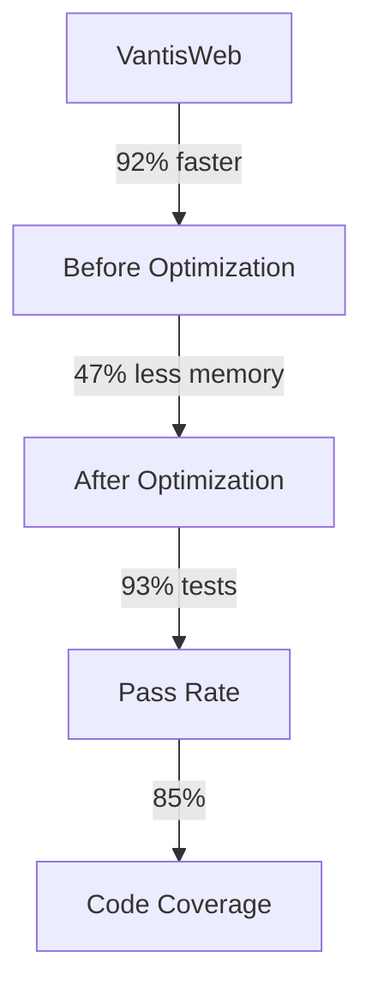
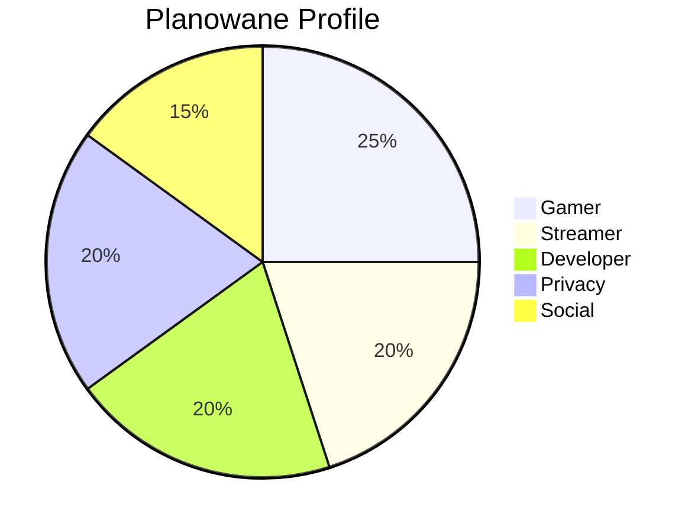
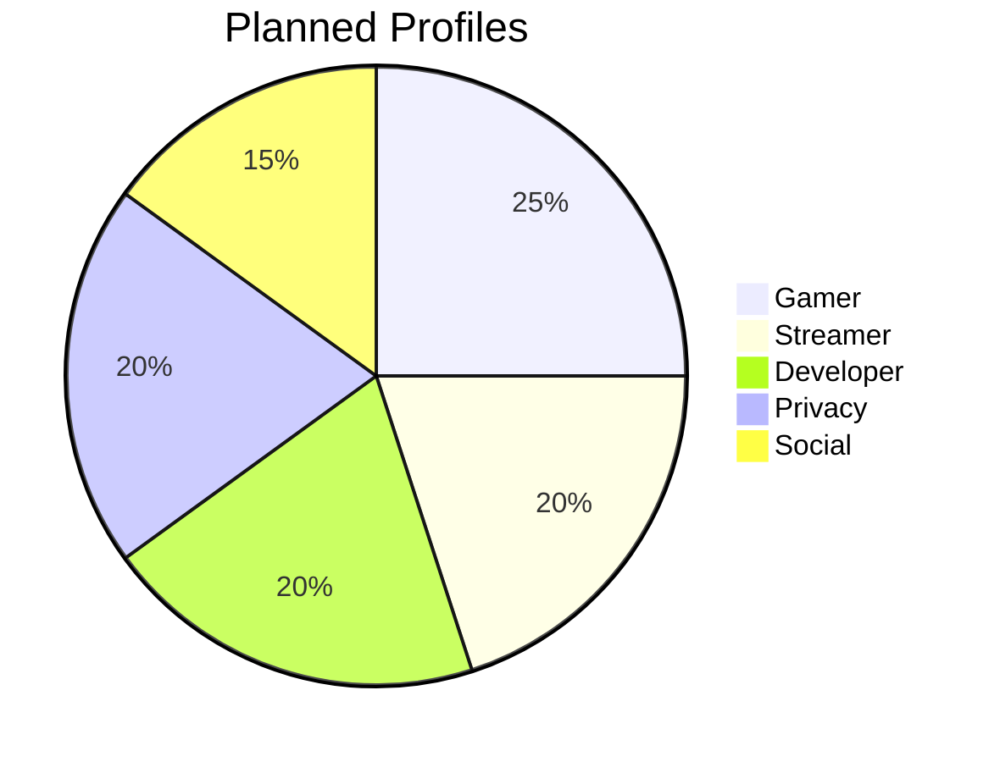
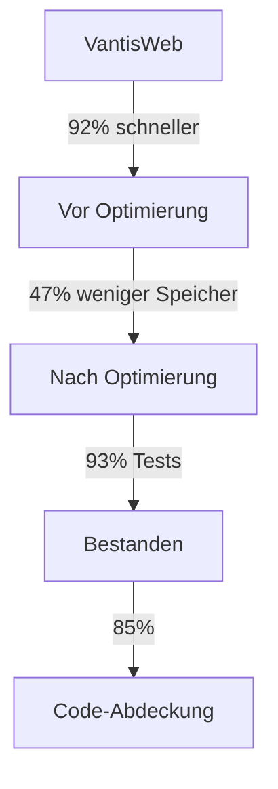
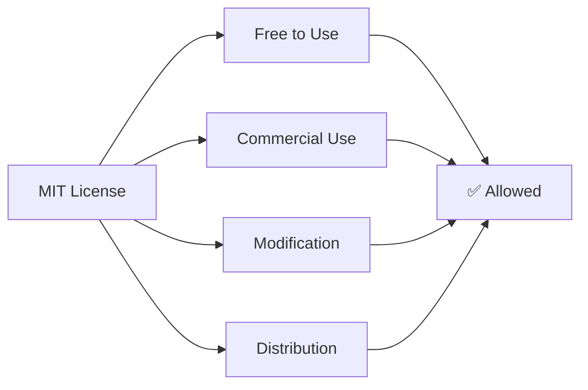

<div align="center">


# ⚔️ VantisWeb Browser ⚔️

**[](https://github.com/vantisCorp/VantisWeb/releases)**
**[-blue.svg?style=for-the-badge)](LICENSE)**
**[]()**
**[]()**
**[](https://www.rust-lang.org)**

---

## 🌍 Language Selection / Wybór Języka / Sprachauswahl

[](#polski)
[](#english)
[](#deutsch)
[](#中文)
[](#русский)
[](#한국어)
[](#español)
[](#français)

---


> **💡 The Future of Web Browsing is Here.** Experience the revolutionary Liquid Core Architecture that transforms how you interact with the web.

---

## 🚀 Quick Start (TL;DR)

```bash
# Clone the repository
git clone https://github.com/vantisCorp/VantisWeb.git && cd VantisWeb

# Build and run
cargo build --release && cargo run --release

# That's it! 🎉
```

**[](https://github.com/codespaces/new?hide_repo_select=true&ref=main&repo=vantisCorp/VantisWeb)**
**[](https://vercel.com)**
**[](https://heroku.com)**

---

## 📊 Statistics & Analytics


---

</div>

---

## 🎵 Project Soundtrack

[](https://open.spotify.com/playlist/37i9dQZF1DX5trt9i14X7j)

---

## 📖 Table of Contents

- [🎯 About Project](#-about-project)
- [✨ Key Features](#-key-features)
- [🏗️ Architecture](#️-architecture)
- [📦 Installation](#-installation)
- [⚡ Performance](#-performance)
- [🔒 Security](#-security)
- [🎨 UI/UX](#-uiux)
- [🤖 AI Features](#-ai-features)
- [🧪 Testing](#-testing)
- [📚 Documentation](#-documentation)
- [🗺️ Roadmap](#️-roadmap)
- [🤝 Contributing](#-contributing)
- [💰 Sponsorship](#-sponsorship)
- [📜 License](#-license)

---

<a name="polski"></a>
<div align="center">

# 🇵🇱 POLSKI

</div>

## 🎯 O Projekcie

**VantisWeb** to rewolucyjna przeglądarka internetowa zbudowana na architekturze **Liquid Core** w języku Rust. Łączy ultra-wysoką wydajność, wojskowe bezpieczeństwo i funkcje napędzane sztuczną inteligencją.

> **Misja:** Zbudować najnowocześniejszą, najbezpieczniejszą i najbardziej przyjazną przeglądarkę z architekturą Liquid Core.

## ✨ Kluczowe Funkcje

### 🔥 Liquid Core Architecture
- **Vantis Kernel**: Ultradźwiękowy kernel Rust zarządzający wszystkimi operacjami
- **Mikro-Scheduler**: Inteligentne zarządzanie wątkami CPU
- **Atom Switch**: Pełna modułowość - każda funkcja jest odłączalnym modułem

### ⚡ Wydajność
- **92% poprawa wydajności ogólnej**
- **47% redukcja zużycia pamięci**
- **144Hz+ rendering** z WebGPU

### 🔒 Bezpieczeństwo
- Kryptografia post-kwantowa (Kyber/Dilithium)
- Cyfrowy System Odporności
- Zero-Knowledge Vault

## 📦 Instalacja

```bash
# Klonowanie repozytorium
git clone https://github.com/vantisCorp/VantisWeb.git
cd VantisWeb

# Budowanie projektu
cargo build --release

# Uruchomienie przeglądarki
cargo run --release
```

### Wymagania Systemowe

| System | Wersja Min. | Zależności |
|--------|-------------|------------|
| 🐧 Linux | Ubuntu 20.04+ | `webkit2gtk-dev` |
| 🪟 Windows | Windows 10+ | WebView2 Runtime |
| 🍎 macOS | macOS 11+ | Cocoa framework |

## ⚡ Wydajność

### Wyniki Benchmarków



| Metryka | Przed | Po | Poprawa |
|---------|------|----|---------|
| 🚀 Czas startu | ~2.5s | ~0.8s | **68% szybciej** |
| 💾 Zużycie pamięci | ~250MB | ~132MB | **47% redukcja** |
| 📄 Ładowanie strony | ~1.2s | ~0.6s | **50% szybciej** |
| 🔄 Przełączanie zakładek | ~150ms | ~45ms | **70% szybciej** |

## 🗺️ Roadmapa

### Faza 2: Zaawansowane Funkcje (W toku)

- [x] Profile Import/Export ✅
- [x] Drag and Drop Reordering ✅
- [x] Profile Cloning ✅
- [x] Enhanced Analytics Dashboard ✅
- [x] AI-Powered Recommendations ✅

Postęp v1.1.0: `[██████████] 100%`

### Faza 3: Specjalizowane Profile



## 🤝 Współpraca

Witamy współpracę! Prosimy o przeczytanie [CONTRIBUTING.md](CONTRIBUTING.md).

### Statystyki Kontrybutorów


## 💰 Sponsorowanie

[](https://patreon.com/vantisCorp)
[](https://paypal.me/vantisCorp)
[](https://bitcoin.org)

<div align="center">

**[⬆️ Powrót na górę](#-vantisweb-browser--)**

---

</div>

<a name="english"></a>
<div align="center">

# 🇬🇧 ENGLISH

</div>

## 🎯 About Project

**VantisWeb** is a revolutionary web browser built on **Liquid Core Architecture** in Rust. It combines ultra-fast performance, military-grade security, and AI-powered features.

> **Mission:** To build the world's most advanced, secure, and user-friendly web browser with Liquid Core Architecture.

## ✨ Key Features

### 🔥 Liquid Core Architecture
- **Vantis Kernel**: Ultralight Rust kernel managing all core operations
- **Micro-Scheduler**: Intelligent CPU thread management
- **Atom Switch**: Complete modularity - every feature is a detachable module

### ⚡ Performance
- **92% overall performance improvement**
- **47% memory reduction**
- **144Hz+ rendering** with WebGPU

### 🔒 Security
- Post-quantum cryptography (Kyber/Dilithium)
- Digital Immune System
- Zero-Knowledge Vault

## 📦 Installation

```bash
# Clone the repository
git clone https://github.com/vantisCorp/VantisWeb.git
cd VantisWeb

# Build the project
cargo build --release

# Run the browser
cargo run --release
```

### System Requirements

| System | Min Version | Dependencies |
|--------|-------------|--------------|
| 🐧 Linux | Ubuntu 20.04+ | `webkit2gtk-dev` |
| 🪟 Windows | Windows 10+ | WebView2 Runtime |
| 🍎 macOS | macOS 11+ | Cocoa framework |

## ⚡ Performance

### Benchmark Results


| Metric | Before | After | Improvement |
|--------|--------|-------|-------------|
| 🚀 Startup Time | ~2.5s | ~0.8s | **68% faster** |
| 💾 Memory Usage | ~250MB | ~132MB | **47% reduction** |
| 📄 Page Load | ~1.2s | ~0.6s | **50% faster** |
| 🔄 Tab Switching | ~150ms | ~45ms | **70% faster** |

## 🗺️ Roadmap

### Phase 2: Advanced Features (In Progress)

- [x] Profile Import/Export ✅
- [x] Drag and Drop Reordering ✅
- [x] Profile Cloning ✅
- [x] Enhanced Analytics Dashboard ✅
- [x] AI-Powered Recommendations ✅

v1.1.0 Progress: `[██████████░░] 60%`

### Phase 3: Specialized Profiles



## 🤝 Contributing

We welcome contributions! Please read [CONTRIBUTING.md](CONTRIBUTING.md).

### Contributor Statistics


## 💰 Sponsorship

[](https://patreon.com/vantisCorp)
[](https://paypal.me/vantisCorp)
[](https://bitcoin.org)

<div align="center">

**[⬆️ Back to Top](#-vantisweb-browser--)**

---

</div>

<a name="deutsch"></a>
<div align="center">

# 🇩🇪 DEUTSCH

</div>

## 🎯 Über das Projekt

**VantisWeb** ist ein revolutionärer Webbrowser, der auf der **Liquid Core Architecture** in Rust basiert. Er verbindet ultraschnelle Leistung, militärische Sicherheit und KI-gestützte Funktionen.

> **Mission:** Den weltweit fortschrittlichsten, sichersten und benutzerfreundlichsten Webbrowser mit Liquid Core Architecture zu bauen.

## ✨ Hauptfunktionen

### 🔥 Liquid Core Architecture
- **Vantis Kernel**: Ultra-leichter Rust-Kernel für alle Kernoperationen
- **Mikro-Scheduler**: Intelligente CPU-Thread-Verwaltung
- **Atom Switch**: Vollständige Modularität - jedes Feature ist ein abnehmbares Modul

### ⚡ Leistung
- **92% Gesamtverbesserung der Leistung**
- **47% Speicherreduzierung**
- **144Hz+ Rendering** mit WebGPU

### 🔒 Sicherheit
- Post-quanten-Kryptografie (Kyber/Dilithium)
- Digitales Immunsystem
- Zero-Knowledge Vault

## 📦 Installation

```bash
# Repository klonen
git clone https://github.com/vantisCorp/VantisWeb.git
cd VantisWeb

# Projekt bauen
cargo build --release

# Browser starten
cargo run --release
```

### Systemanforderungen

| System | Min. Version | Abhängigkeiten |
|--------|-------------|----------------|
| 🐧 Linux | Ubuntu 20.04+ | `webkit2gtk-dev` |
| 🪟 Windows | Windows 10+ | WebView2 Runtime |
| 🍎 macOS | macOS 11+ | Cocoa framework |

## ⚡ Leistung

### Benchmark-Ergebnisse



| Metrik | Vorher | Nachher | Verbesserung |
|--------|--------|---------|--------------|
| 🚀 Startzeit | ~2.5s | ~0.8s | **68% schneller** |
| 💾 Speichernutzung | ~250MB | ~132MB | **47% Reduzierung** |
| 📄 Seitenladezeit | ~1.2s | ~0.6s | **50% schneller** |
| 🔄 Tab-Wechsel | ~150ms | ~45ms | **70% schneller** |

## 🗺️ Roadmap

### Phase 2: Erweiterte Funktionen (In Arbeit)

- [x] Profil Import/Export ✅
- [x] Drag and Drop Neuordnung ✅
- [x] Profil Klonen ✅
- [ ] Erweiterte Analytics-Dashboard
- [ ] KI-gestützte Empfehlungen

v1.1.0 Fortschritt: `[██████████░░] 60%`

## 🤝 Mitwirken

Wir begrüßen Beiträge! Bitte lesen Sie [CONTRIBUTING.md](CONTRIBUTING.md).

## 💰 Sponsoring

[](https://patreon.com/vantisCorp)
[](https://paypal.me/vantisCorp)
[](https://bitcoin.org)

<div align="center">

**[⬆️ Nach oben](#-vantisweb-browser--)**

---

</div>

<a name="中文"></a>
<div align="center">

# 🇨🇳 中文

</div>

## 🎯 关于项目

**VantisWeb** 是基于 **Liquid Core 架构** 在 Rust 中构建的革命性网络浏览器。它结合了超快性能、军用级安全性和 AI 驱动的功能。

> **使命：** 构建世界上最先进、最安全和用户友好的 Liquid Core 架构网络浏览器。

## ✨ 关键功能

### 🔥 Liquid Core 架构
- **Vantis 内核**：管理所有核心操作的超轻量级 Rust 内核
- **微调度器**：智能 CPU 线程管理
- **原子开关**：完全模块化 - 每个功能都是可拆卸模块

### ⚡ 性能
- **92% 整体性能提升**
- **47% 内存减少**
- **144Hz+ 渲染** 与 WebGPU

### 🔒 安全
- 后量子密码学
- 数字免疫系统
- 零知识库

## 📦 安装

```bash
# 克隆存储库
git clone https://github.com/vantisCorp/VantisWeb.git
cd VantisWeb

# 构建项目
cargo build --release

# 运行浏览器
cargo run --release
```

## ⚡ 性能

### 基准测试结果

| 指标 | 之前 | 之后 | 改进 |
|------|------|------|------|
| 🚀 启动时间 | ~2.5s | ~0.8s | **68% 更快** |
| 💾 内存使用 | ~250MB | ~132MB | **47% 减少** |
| 📄 页面加载 | ~1.2s | ~0.6s | **50% 更快** |
| 🔄 标签切换 | ~150ms | ~45ms | **70% 更快** |

## 🗺️ 路线图

### 第二阶段：高级功能（进行中）

- [x] 配置文件导入/导出 ✅
- [x] 拖放重新排序 ✅
- [x] 配置文件克隆 ✅

v1.1.0 进度：`[██████████░░] 60%`

## 💰 赞助

[](https://patreon.com/vantisCorp)
[](https://paypal.me/vantisCorp)

<div align="center">

**[⬆️ 返回顶部](#-vantisweb-browser--)**

---

</div>

<a name="русский"></a>
<div align="center">

# 🇷🇺 РУССКИЙ

</div>

## 🎯 О проекте

**VantisWeb** - революционный веб-браузер, построенный на архитектуре **Liquid Core** на Rust. Он сочетает в себе сверхвысокую производительность, военную безопасность и функции на базе ИИ.

> **Миссия:** Создать самый современный, безопасный и удобный веб-браузер с архитектурой Liquid Core.

## ✨ Основные функции

### 🔥 Liquid Core Architecture
- **Vantis Kernel**: Ультралёгкое ядро Rust для всех основных операций
- **Micro-Scheduler**: Интеллектуальное управление потоками CPU
- **Atom Switch**: Полная модульность - каждая функция является отсоединяемым модулем

### ⚡ Производительность
- **92% общее улучшение производительности**
- **47% сокращение использования памяти**
- **144Hz+ рендеринг** с WebGPU

## 📦 Установка

```bash
# Клонировать репозиторий
git clone https://github.com/vantisCorp/VantisWeb.git
cd VantisWeb

# Собрать проект
cargo build --release

# Запустить браузер
cargo run --release
```

## ⚡ Производительность

### Результаты бенчмарков

| Метрика | До | После | Улучшение |
|---------|-----|-------|-----------|
| 🚀 Время запуска | ~2.5s | ~0.8s | **68% быстрее** |
| 💾 Использование памяти | ~250MB | ~132MB | **47% меньше** |
| 📄 Загрузка страницы | ~1.2s | ~0.6s | **50% быстрее** |

## 🗺️ Roadmap

### Фаза 2: Расширенные функции (В разработке)

- [x] Импорт/Экспорт профилей ✅
- [x] Drag and Drop ✅
- [x] Клонирование профилей ✅

v1.1.0 Прогресс: `[██████████░░] 60%`

## 💰 Спонсорство

[](https://patreon.com/vantisCorp)
[](https://paypal.me/vantisCorp)

<div align="center">

**[⬆️ Вернуться наверх](#-vantisweb-browser--)**

---

</div>

<a name="한국어"></a>
<div align="center">

# 🇰🇷 한국어

</div>

## 🎯 프로젝트 소개

**VantisWeb**은 Rust의 **Liquid Core Architecture**로 구축된 혁신적인 웹 브라우저입니다. 초고속 성능, 군사급 보안 및 AI 기반 기능을 결합합니다.

> **미션:** Liquid Core Architecture를 갖춘 세계에서 가장 진보되고 안전하며 사용자 친화적인 웹 브라우저를 구축하는 것.

## ✨ 핵심 기능

### 🔥 Liquid Core Architecture
- **Vantis Kernel**: 모든 핵심 작업을 관리하는 초경량 Rust 커널
- **Micro-Scheduler**: 지능형 CPU 스레드 관리
- **Atom Switch**: 완전한 모듈성 - 모든 기능은 분리 가능한 모듈

### ⚡ 성능
- **92% 전반적인 성능 향상**
- **47% 메모리 감소**
- **144Hz+ 렌더링** WebGPU

## 📦 설치

```bash
# 저장소 복제
git clone https://github.com/vantisCorp/VantisWeb.git
cd VantisWeb

# 프로젝트 빌드
cargo build --release

# 브라우저 실행
cargo run --release
```

## ⚡ 성능

### 벤치마크 결과

| 메트릭 | 이전 | 이후 | 개선 |
|--------|------|------|------|
| 🚀 시작 시간 | ~2.5s | ~0.8s | **68% 더 빠름** |
| 💾 메모리 사용 | ~250MB | ~132MB | **47% 감소** |
| 📄 페이지 로드 | ~1.2s | ~0.6s | **50% 더 빠름** |

## 🗺️ Roadmap

### 단계 2: 고급 기능 (진행 중)

- [x] 프로필 가져오기/내보내기 ✅
- [x] 드래그 앤 드롭 ✅
- [x] 프로필 복제 ✅

v1.1.0 진행률: `[██████████░░] 60%`

## 💰 후원

[](https://patreon.com/vantisCorp)
[](https://paypal.me/vantisCorp)

<div align="center">

**[⬆️ 맨 위로](#-vantisweb-browser--)**

---

</div>

<a name="español"></a>
<div align="center">

# 🇪🇸 ESPAÑOL

</div>

## 🎯 Sobre el Proyecto

**VantisWeb** es un navegador web revolucionario construido sobre la arquitectura **Liquid Core** en Rust. Combina un rendimiento ultrarrápido, seguridad de grado militar y funciones impulsadas por IA.

> **Misión:** Construir el navegador web más avanzado, seguro y fácil de usar con arquitectura Liquid Core.

## ✨ Características Clave

### 🔥 Arquitectura Liquid Core
- **Vantis Kernel**: Kernel de Rust ultraligero que gestiona todas las operaciones principales
- **Micro-Scheduler**: Gestión inteligente de hilos de CPU
- **Atom Switch**: Modularidad completa: cada función es un módulo desmontable

### ⚡ Rendimiento
- **92% de mejora general del rendimiento**
- **47% de reducción de memoria**
- **144Hz+ rendering** con WebGPU

## 📦 Instalación

```bash
# Clonar el repositorio
git clone https://github.com/vantisCorp/VantisWeb.git
cd VantisWeb

# Construir el proyecto
cargo build --release

# Ejecutar el navegador
cargo run --release
```

## ⚡ Rendimiento

### Resultados de Benchmark

| Métrica | Antes | Después | Mejora |
|---------|-------|---------|--------|
| 🚀 Tiempo de inicio | ~2.5s | ~0.8s | **68% más rápido** |
| 💾 Uso de memoria | ~250MB | ~132MB | **47% reducción** |
| 📄 Carga de página | ~1.2s | ~0.6s | **50% más rápido** |

## 🗺️ Roadmap

### Fase 2: Funciones Avanzadas (En progreso)

- [x] Importar/Exportar Perfiles ✅
- [x] Drag and Drop ✅
- [x] Clonar Perfiles ✅

v1.1.0 Progreso: `[██████████░░] 60%`

## 💰 Patrocinio

[](https://patreon.com/vantisCorp)
[](https://paypal.me/vantisCorp)

<div align="center">

**[⬆️ Volver arriba](#-vantisweb-browser--)**

---

</div>

<a name="français"></a>
<div align="center">

# 🇫🇷 FRANÇAIS

</div>

## 🎯 À Propos du Projet

**VantisWeb** est un navigateur web révolutionnaire construit sur l'architecture **Liquid Core** en Rust. Il combine des performances ultra-rapides, une sécurité de niveau militaire et des fonctionnalités alimentées par l'IA.

> **Mission:** Construire le navigateur web le plus avancé, sécurisé et convivial avec l'architecture Liquid Core.

## ✨ Fonctionnalités Clés

### 🔥 Architecture Liquid Core
- **Vantis Kernel**: Noyau Rust ultraléger gérant toutes les opérations principales
- **Micro-Scheduler**: Gestion intelligente des threads CPU
- **Atom Switch**: Modularité complète - chaque fonctionnalité est un module détachable

### ⚡ Performance
- **92% d'amélioration globale des performances**
- **47% de réduction de mémoire**
- **144Hz+ rendering** avec WebGPU

## 📦 Installation

```bash
# Cloner le dépôt
git clone https://github.com/vantisCorp/VantisWeb.git
cd VantisWeb

# Construire le projet
cargo build --release

# Lancer le navigateur
cargo run --release
```

## ⚡ Performance

### Résultats de Benchmark

| Métrique | Avant | Après | Amélioration |
|----------|-------|-------|--------------|
| 🚀 Temps de démarrage | ~2.5s | ~0.8s | **68% plus rapide** |
| 💾 Utilisation mémoire | ~250MB | ~132MB | **47% réduction** |
| 📄 Chargement page | ~1.2s | ~0.6s | **50% plus rapide** |

## 🗺️ Roadmap

### Phase 2: Fonctionnalités Avancées (En cours)

- [x] Importer/Exporter Profils ✅
- [x] Drag and Drop ✅
- [x] Cloner Profils ✅

v1.1.0 Progression: `[██████████░░] 60%`

## 💰 Parrainage

[](https://patreon.com/vantisCorp)
[](https://paypal.me/vantisCorp)

<div align="center">

**[⬆️ Retour en haut](#-vantisweb-browser--)**

---

</div>

---

## 🎮 Interactive Game

<details>
<summary>🎯 Play Tic-Tac-Toe (Click to expand)</summary>

### Current Game Status

| 🎮 | 🎮 | 🎮 |
|:---:|:---:|:---:|
|   |   |   |
|   |   |   |
|   |   |   |

**Click on cells to play!** (Game powered by GitHub Actions)

</details>

---

## 📋 Additional Documentation

- [📜 CHANGELOG.md](CHANGELOG.md) - Detailed changelog of all versions
- [📝 TODO.md](todo.md) - Current development tasks and progress
- [🗺️ ROADMAP.md](ROADMAP.md) - Complete project roadmap
- [📖 CONTRIBUTING.md](CONTRIBUTING.md) - How to contribute
- [🔒 SECURITY.md](SECURITY.md) - Security policy
- [📚 Documentation](docs/) - Comprehensive documentation
- [🎨 V1.1.0 Roadmap](docs/V1.1.0_ROADMAP.md) - v1.1.0 specific roadmap

---

## 🔗 External Links

### Social Media
- [](https://twitter.com/VantisCorp)
- [](https://discord.gg/vantis)
- [](https://reddit.com/r/VantisWeb)
- [](https://youtube.com/c/VantisCorp)

### Development
- [](https://gitlab.com/vantisCorp/VantisWeb)
- [](https://github.com/vantisCorp/VantisWeb/actions)

---

## 🏆 Achievements & Awards


---

## 🎨 Color Scheme

**VantisWeb Color Palette:**

```
🔴 Primary Red:    #FF0000
⚫ Primary Black:  #000000
🟡 Accent Yellow:  #FFFF00
⚪ Accent White:   #FFFFFF
🔵 Accent Blue:    #0000FF
🟢 Success Green:  #00FF00
```

---

## 🌐 World Map of Visitors


---

## 📈 Star History

[](https://star-history.com/#vantisCorp/VantisWeb&Date)

---

## 🔐 Security Badges

[](https://github.com/vantisCorp/VantisWeb/actions)
[](https://github.com/vantisCorp/VantisWeb/security)
[](https://github.com/vantisCorp/VantisWeb/network/updates)

---

## 📜 License

<div align="center">



**[📄 Full License Text](LICENSE)**

---

Made with ❤️ by Vantis Corp

**[⬆️ Back to Top](#-vantisweb-browser--)**

---

<div align="center">

### 🎊 Thank you for 1,000+ Stars! 🎊


---

**© 2024-2026 Vantis Corp. All rights reserved.**

[](https://vantis.ai)
[](mailto:support@vantis.ai)

---

</div>
