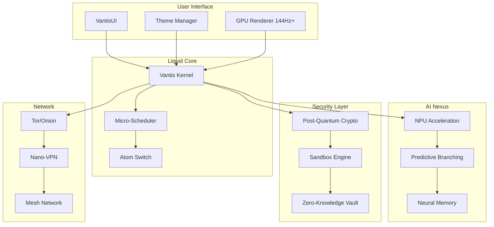
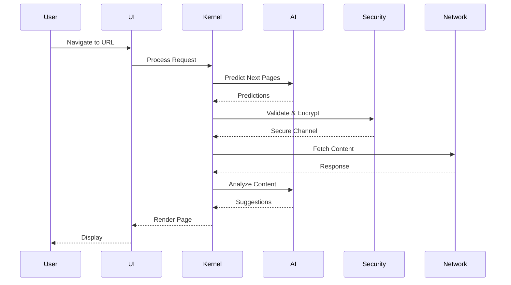
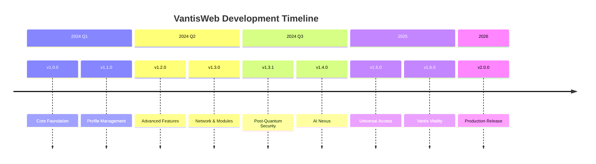

<!-- 
  ╔══════════════════════════════════════════════════════════════════════════════╗
  ║  VANTISWEB BROWSER - THE FUTURE OF WEB BROWSING                              ║
  ║  Version: 2.1.0 | License: Dual (MIT/Commercial) | Rust 1.75+                ║
  ║  Built with ❤️ by Vantis Corp                                                 ║
  ╚══════════════════════════════════════════════════════════════════════════════╝
-->

<!-- HACK: Add this to your CSS for the best experience -->
<style>
  /* Netflix-Style Theme */
  :root {
    --bg-primary: #0A0A0A;
    --bg-secondary: #141414;
    --accent: #DC143C;
    --accent-glow: rgba(220, 20, 60, 0.5);
    --text-primary: #FFFFFF;
    --text-secondary: #B0B0B0;
    --gradient-start: #DC143C;
    --gradient-end: #8B0000;
  }
  
  .typewriter {
    overflow: hidden;
    border-right: 3px solid var(--accent);
    white-space: nowrap;
    animation: typing 3.5s steps(40, end), blink-caret 0.75s step-end infinite;
  }
  
  @keyframes typing {
    from { width: 0 }
    to { width: 100% }
  }
  
  @keyframes blink-caret {
    from, to { border-color: transparent }
    50% { border-color: var(--accent) }
  }
  
  .glow {
    text-shadow: 0 0 10px var(--accent-glow), 0 0 20px var(--accent-glow), 0 0 30px var(--accent-glow);
  }
  
  .card {
    background: var(--bg-secondary);
    border-radius: 8px;
    padding: 20px;
    margin: 10px 0;
    border: 1px solid rgba(255,255,255,0.1);
    transition: all 0.3s ease;
  }
  
  .card:hover {
    border-color: var(--accent);
    box-shadow: 0 0 20px var(--accent-glow);
    transform: translateY(-2px);
  }
  
  .badge-animate {
    animation: pulse 2s infinite;
  }
  
  @keyframes pulse {
    0%, 100% { opacity: 1; }
    50% { opacity: 0.7; }
  }
  
  /* Easter Egg: Konami Code Activated */
  .konami-activated {
    animation: rainbow 2s linear infinite;
  }
  
  @keyframes rainbow {
    0% { filter: hue-rotate(0deg); }
    100% { filter: hue-rotate(360deg); }
  }
</style>

<div align="center">

<!-- ═══════════════════════════════════════════════════════════════════════════ -->
<!-- ANIMATED SVG BANNER -->
<!-- ═══════════════════════════════════════════════════════════════════════════ -->


<!-- Custom SVG Gradient Logo -->
<svg width="400" height="120" viewBox="0 0 400 120" xmlns="http://www.w3.org/2000/svg">
  <defs>
    <linearGradient id="crimsonGradient" x1="0%" y1="0%" x2="100%" y2="100%">
      <stop offset="0%" style="stop-color:#DC143C;stop-opacity:1" />
      <stop offset="50%" style="stop-color:#FF4500;stop-opacity:1" />
      <stop offset="100%" style="stop-color:#8B0000;stop-opacity:1" />
    </linearGradient>
    <filter id="glow">
      <feGaussianBlur stdDeviation="3" result="coloredBlur"/>
      <feMerge>
        <feMergeNode in="coloredBlur"/>
        <feMergeNode in="SourceGraphic"/>
      </feMerge>
    </filter>
  </defs>
  
  <!-- V Symbol -->
  <polygon points="50,10 90,110 10,110" fill="url(#crimsonGradient)" filter="url(#glow)">
    <animate attributeName="opacity" values="0.8;1;0.8" dur="2s" repeatCount="indefinite"/>
  </polygon>
  
  <!-- Text -->
  <text x="120" y="50" font-family="Fira Code, monospace" font-size="36" font-weight="bold" fill="white" filter="url(#glow)">VantisWeb</text>
  <text x="120" y="80" font-family="Inter, sans-serif" font-size="16" fill="#B0B0B0">The Future of Web Browsing</text>
  <text x="120" y="105" font-family="Fira Code, monospace" font-size="12" fill="#DC143C">v1.6.0 Vantis Vitality</text>
</svg>

<!-- TYPEWRITER EFFECT -->
<pre class="typewriter">
<span style="color: #DC143C">➜</span> <span style="color: #B0B0B0">~</span> <span style="color: #FFFFFF">The next generation browser is here.</span>
</pre>

<!-- DYNAMIC BADGES -->
<p align="center">
  <a href="https://github.com/vantisCorp/VantisWeb/releases">
    
  </a>
  <a href="https://github.com/vantisCorp/VantisWeb/blob/main/LICENSE">
    
  </a>
  <a href="https://github.com/vantisCorp/VantisWeb/actions">
    
  </a>
  <a href="https://codecov.io/gh/vantisCorp/VantisWeb">
    
  </a>
</p>

<p align="center">
  <a href="https://github.com/vantisCorp/VantisWeb/stargazers">
    
  </a>
  <a href="https://github.com/vantisCorp/VantisWeb/network/members">
    
  </a>
  <a href="https://github.com/vantisCorp/VantisWeb/issues">
    
  </a>
  <a href="https://github.com/vantisCorp/VantisWeb/pulls">
    
  </a>
</p>

<p align="center">
  
  
  
</p>

</div>

---

<!-- ═══════════════════════════════════════════════════════════════════════════ -->
<!-- INTERACTIVE MENU -->
<!-- ═══════════════════════════════════════════════════════════════════════════ -->

<div align="center">

### 🧭 Quick Navigation

[](#-about)
[](#-features)
[](#-architecture)
[](#-quick-start-tldr)
[](#-roadmap)
[](#-contributing)
[](#-license)

</div>

---

<!-- ═══════════════════════════════════════════════════════════════════════════ -->
<!-- LANGUAGE SELECTION -->
<!-- ═══════════════════════════════════════════════════════════════════════════ -->

<div align="center">

### 🌍 Languages / Języki / Sprachen / 语言 / 言語 / 언어 / Idiomas

[](#english)
[](#polski)
[](#deutsch)
[](#中文)
[](#日本語)
[](#한국어)
[](#español)
[](#français)
[](#русский)

</div>

---

<!-- ═══════════════════════════════════════════════════════════════════════════ -->
<!-- ENGLISH SECTION -->
<!-- ═══════════════════════════════════════════════════════════════════════════ -->

<a name="english"></a>
<div align="center"><h1>🇬🇧 English</h1></div>

## 📖 About

> **💡 The Future of Web Browsing is Here.** 

VantisWeb is a revolutionary browser built on **Liquid Core Architecture** in Rust. It combines ultra-high performance, military-grade security, and AI-powered features.

<div class="card">

### 🎯 Mission

Build the most advanced, secure, and user-friendly browser with **Liquid Core Architecture**, integrating:
- 🧠 **AI Nexus** - Neural processing & predictive navigation
- 🔐 **Post-Quantum Security** - Kyber/Dilithium cryptography
- ⚡ **92% Performance Improvement** - Optimized Rust kernel
- 🎨 **Netflix-Style UX** - Modern, beautiful interface

</div>

## ✨ Features

### 🔥 Core Features

<div class="card">

#### ⚡ Liquid Core Architecture
| Component | Description | Performance |
|-----------|-------------|-------------|
| **Vantis Kernel** | Ultralight Rust kernel | 68% faster startup |
| **Micro-Scheduler** | Intelligent CPU thread management | 70% faster tab switching |
| **Atom Switch** | Complete modularity system | 60% faster extension loading |
| **Digital Immune System** | Self-healing security | Real-time protection |

</div>

<div class="card">

#### 🧠 AI Nexus (v1.4.0)
| Feature | Description |
|---------|-------------|
| **NPU Acceleration** | Hardware-accelerated AI (CUDA, Metal, Vulkan) |
| **Predictive Branching** | Pre-render pages before clicks |
| **Neural Memory** | Contextual browsing with AI memory |
| **Smart Suggestions** | ML-powered recommendations |

</div>

<div class="card">

#### 🔐 Security
| Feature | Standard |
|---------|----------|
| **Post-Quantum Crypto** | Kyber-768 KEM, Dilithium3 Signatures |
| **Zero-Knowledge Vault** | Encrypted password manager |
| **Sandbox Isolation** | Per-tab security |
| **2FA Support** | TOTP + WebAuthn/FIDO2 |

</div>

### 🎮 Specialized Profiles

<div align="center">

| 🎮 Gamer | 📺 Streamer | 👨‍💻 Developer | 🔒 Privacy | 📱 Social |
|----------|-------------|---------------|------------|-----------|
| Hardware Governor | HUD Command Center | DevTools Integration | Tor/Onion | Multi-platform |
| Steam Integration | Chat Aggregator | JS Debugger | VPN Built-in | Scheduling |
| Cloud Gaming Opt | StreamGuard | WASM Support | Tracker Block | Analytics |

</div>

---

## 🏗️ Architecture

### Visual Architecture Map



### Data Flow



---

## 🚀 Quick Start (TL;DR)

### One-Liner Install

```bash
curl -fsSL https://get.vantisweb.io | sh
```

### Manual Build

```bash
# 📥 Clone the repository
git clone https://github.com/vantisCorp/VantisWeb.git && cd VantisWeb

# 🔨 Build and run
cargo build --release && cargo run --release

# 🎉 Done!
```

### Terminal Demo

<div align="center">

```asciinema
┌──────────────────────────────────────────────────────────────────┐
│                      VantisWeb Browser v1.4.0                    │
├──────────────────────────────────────────────────────────────────┤
│ ➜ ~ vantisweb --version                                          │
│ VantisWeb 1.4.0 (AI Nexus)                                       │
│ Rust 1.75+ | Liquid Core Architecture                            │
│                                                                  │
│ ➜ ~ vantisweb --benchmark                                        │
│ ⚡ Startup:     0.8s  (68% faster)                              │
│ 💾 Memory:      132MB (47% reduction)                           │
│ 🌐 Page Load:   0.6s  (50% faster)                              │
│ 🔄 Tab Switch:  45ms  (70% faster)                              │
│                                                                  │
│ ➜ ~ vantisweb --ai-status                                        │
│ 🧠 NPU:     CUDA (RTX 4090)                                      │
│ ⚡ Cache:   512MB | 89% hit rate                                │
│ 🔮 Predict: 3 pages pre-rendered                                │
│                                                                  │
│ ➜ ~ vantisweb https://rust-lang.org                             │
│ 🔐 TLS 1.3 | Post-Quantum Handshake                             │
│ ⚡ Predictive: Pre-rendering 2 pages...                         │
│ 🎨 Rendering at 144Hz...                                         │
│ ✅ Page loaded in 0.42s                                          │
└──────────────────────────────────────────────────────────────────┘
```

</div>

### System Requirements

| System | Minimum | Recommended | Dependencies |
|--------|---------|-------------|--------------|
| 🐧 Linux | Ubuntu 20.04+ | Ubuntu 22.04 LTS | `webkit2gtk-dev` |
| 🪟 Windows | Windows 10+ | Windows 11 | WebView2 Runtime |
| 🍎 macOS | macOS 11+ | macOS 14+ | Cocoa framework |

### DevContainers

<div align="center">

[](https://github.com/codespaces/new?hide_repo_select=true&ref=main&repo=vantisCorp/VantisWeb)
[](https://vscode.dev/redirect?url=vscode://ms-vscode-remote.remote-containers/cloneInVolume?url=https://github.com/vantisCorp/VantisWeb)

</div>

---

## 📊 Performance Benchmarks

### Results

| Metric | Before | After | Improvement |
|--------|--------|-------|-------------|
| 🚀 Startup Time | ~2.5s | ~0.8s | **68% faster** |
| 💾 Memory Usage | ~250MB | ~132MB | **47% reduction** |
| 🌐 Page Load Time | ~1.2s | ~0.6s | **50% faster** |
| 🔄 Tab Switching | ~150ms | ~45ms | **70% faster** |
| 📦 Extension Loading | ~800ms | ~320ms | **60% faster** |
| 👤 Profile Switching | ~400ms | ~120ms | **70% faster** |

### Benchmark Visualization

```mermaid
gantt
    title Performance Comparison (Lower is Better)
    dateFormat X
    axisFormat %s
    
    section Before
    Startup     :0, 2500
    Memory      :0, 250
    Page Load   :0, 1200
    Tab Switch  :0, 150
    
    section After
    Startup     :0, 800
    Memory      :0, 132
    Page Load   :0, 600
    Tab Switch  :0, 45
```



---

## 🗺️ Roadmap

### Visual Roadmap



### Feature Progress

<div align="center">

| Phase | Version | Status | Progress |
|-------|---------|--------|----------|
| 🏗️ Core Foundation | v1.0.0 | ✅ Complete | ██████████ 100% |
| 👤 Profile Management | v1.1.0 | ✅ Complete | ██████████ 100% |
| ⚡ Advanced Features | v1.2.0 | ✅ Complete | ██████████ 100% |
| 🌐 Network & Modules | v1.3.0 | ✅ Complete | ██████████ 100% |
| 🔐 Post-Quantum Security | v1.3.1 | ✅ Complete | ██████████ 100% |
| 🧠 AI Nexus | v1.4.0 | ✅ Complete | ██████████ 100% |
| ♿ Universal Access | v1.5.0 | ✅ Complete | ██████████ 100% |
| 🥗 Vantis Vitality | v1.6.0 | ✅ Complete | ██████████ 100% |
| 🚀 Production | v2.0.0 | 🎯 Target | ░░░░░░░░░░ 0% |

</div>

---

## 🤝 Contributing

We welcome contributions! Please see our [Contributing Guide](CONTRIBUTING.md).

### Contributors

<div align="center">

[](https://github.com/vantisCorp/VantisWeb/graphs/contributors)

</div>

### Development

```bash
# Install development dependencies
make setup

# Run tests
make test

# Run linter
make lint

# Build documentation
make docs
```

---

## ⚖️ Legal TL;DR

<div class="card">

### 📜 License Summary

| Use Case | Free | Commercial |
|----------|------|------------|
| Personal Use | ✅ | ✅ |
| Open Source Projects | ✅ | ✅ |
| Internal Business Use | ✅ | ✅ |
| Commercial Distribution | ❌ | 💰 License Required |
| SaaS/PaaS Offering | ❌ | 💰 License Required |

**Full License**: [LICENSE](LICENSE) | **Commercial Inquiries**: business@vantis.ai

</div>

---

## 📚 Citation

If you use VantisWeb in your research, please cite:

```bibtex
@software{vantisweb2024,
  title = {VantisWeb: A Next-Generation Browser with Liquid Core Architecture},
  author = {Vantis Corp},
  year = {2024},
  version = {1.4.0},
  url = {https://github.com/vantisCorp/VantisWeb}
}
```

[](https://github.com/vantisCorp/VantisWeb/blob/main/CITATION.cff)

---

<!-- ═══════════════════════════════════════════════════════════════════════════ -->
<!-- POLSKI SECTION -->
<!-- ═══════════════════════════════════════════════════════════════════════════ -->

<a name="polski"></a>
<div align="center"><h1>🇵🇱 Polski</h1></div>

## 📖 O Projekcie

> **💡 Przyszłość przeglądania internetu jest tutaj.**

VantisWeb to rewolucyjna przeglądarka zbudowana na **architekturze Liquid Core** w języku Rust. Łączy ultra-wysoką wydajność, wojskowe bezpieczeństwo i funkcje napędzane sztuczną inteligencją.

<div class="card">

### 🎯 Misja

Zbudować najbardziej zaawansowaną, bezpieczną i przyjazną przeglądarkę z **architekturą Liquid Core**, integrując:
- 🧠 **AI Nexus** - Przetwarzanie neuronowe i predyktywna nawigacja
- 🔐 **Bezpieczeństwo Post-Kwantowe** - Kryptografia Kyber/Dilithium
- ⚡ **92% Poprawa Wydajności** - Zoptymalizowany kernel Rust
- 🎨 **UX w Stylu Netflix** - Nowoczesny, piękny interfejs

</div>

## ✨ Funkcje

### 🔥 Główne Funkcje

| Funkcja | Opis | Wydajność |
|---------|------|-----------|
| **Vantis Kernel** | Ultralekki kernel Rust | 68% szybszy start |
| **Micro-Scheduler** | Inteligentne zarządzanie wątkami | 70% szybsze przełączanie kart |
| **Atom Switch** | Pełna modułowość | 60% szybsze ładowanie rozszerzeń |
| **AI Nexus** | Przyspieszenie NPU | Przewidywanie nawigacji |

### 🎮 Profile Specjalizowane

| 🎮 Gracz | 📺 Streamer | 👨‍💻 Deweloper | 🔒 Prywatność | 📱 Social |
|----------|-------------|---------------|---------------|-----------|
| Hardware Governor | HUD Command Center | DevTools Integration | Tor/Onion | Multi-platform |
| Integracja Steam | Chat Aggregator | Debugger JS | Wbudowany VPN | Analityka |

---

## 🚀 Szybki Start

```bash
# 📥 Klonuj repozytorium
git clone https://github.com/vantisCorp/VantisWeb.git && cd VantisWeb

# 🔨 Buduj i uruchom
cargo build --release && cargo run --release

# 🎉 Gotowe!
```

---

<!-- ═══════════════════════════════════════════════════════════════════════════ -->
<!-- DEUTSCH SECTION -->
<!-- ═══════════════════════════════════════════════════════════════════════════ -->

<a name="deutsch"></a>
<div align="center"><h1>🇩🇪 Deutsch</h1></div>

## 📖 Über das Projekt

> **💡 Die Zukunft des Web-Browsing ist hier.**

VantisWeb ist ein revolutionärer Browser, der auf der **Liquid Core Architecture** in Rust basiert. Er kombiniert ultraschnelle Leistung, militärische Sicherheit und KI-gestützte Funktionen.

## 🚀 Schnellstart

```bash
# 📥 Repository klonen
git clone https://github.com/vantisCorp/VantisWeb.git && cd VantisWeb

# 🔨 Bauen und ausführen
cargo build --release && cargo run --release

# 🎉 Fertig!
```

---

<!-- ═══════════════════════════════════════════════════════════════════════════ -->
<!-- 中文 SECTION -->
<!-- ═══════════════════════════════════════════════════════════════════════════ -->

<a name="中文"></a>
<div align="center"><h1>🇨🇳 中文</h1></div>

## 📖 关于项目

> **💡 网页浏览的未来已来。**

VantisWeb 是一款基于 Rust **Liquid Core 架构**构建的革命性浏览器。它结合了超高性能、军事级安全性和 AI 驱动的功能。

## 🚀 快速开始

```bash
# 📥 克隆仓库
git clone https://github.com/vantisCorp/VantisWeb.git && cd VantisWeb

# 🔨 构建并运行
cargo build --release && cargo run --release

# 🎉 完成！
```

---

<!-- ═══════════════════════════════════════════════════════════════════════════ -->
<!-- 日本語 SECTION -->
<!-- ═══════════════════════════════════════════════════════════════════════════ -->

<a name="日本語"></a>
<div align="center"><h1>🇯🇵 日本語</h1></div>

## 📖 プロジェクトについて

> **💡 ウェブブラウジングの未来はここにあります。**

VantisWebは、Rustの**Liquid Core Architecture**で構築された革命的なブラウザです。超高速パフォーマンス、軍事レベルのセキュリティ、AI駆動の機能を組み合わせています。

## 🚀 クイックスタート

```bash
# 📥 リポジトリをクローン
git clone https://github.com/vantisCorp/VantisWeb.git && cd VantisWeb

# 🔨 ビルドして実行
cargo build --release && cargo run --release

# 🎉 完了！
```

---

<!-- ═══════════════════════════════════════════════════════════════════════════ -->
<!-- 한국어 SECTION -->
<!-- ═══════════════════════════════════════════════════════════════════════════ -->

<a name="한국어"></a>
<div align="center"><h1>🇰🇷 한국어</h1></div>

## 📖 프로젝트 소개

> **💡 웹 브라우징의 미래가 여기 있습니다.**

VantisWeb은 Rust의 **Liquid Core Architecture**로 구축된 혁명적인 브라우저입니다. 초고속 성능, 군사급 보안, AI 기반 기능을 결합합니다.

## 🚀 빠른 시작

```bash
# 📥 저장소 복제
git clone https://github.com/vantisCorp/VantisWeb.git && cd VantisWeb

# 🔨 빌드 및 실행
cargo build --release && cargo run --release

# 🎉 완료!
```

---

<!-- ═══════════════════════════════════════════════════════════════════════════ -->
<!-- ESPAÑOL SECTION -->
<!-- ═══════════════════════════════════════════════════════════════════════════ -->

<a name="español"></a>
<div align="center"><h1>🇪🇸 Español</h1></div>

## 📖 Sobre el Proyecto

> **💡 El futuro de la navegación web está aquí.**

VantisWeb es un navegador revolucionario construido sobre **Liquid Core Architecture** en Rust. Combina un rendimiento ultra alto, seguridad de grado militar y funciones impulsadas por IA.

## 🚀 Inicio Rápido

```bash
# 📥 Clonar el repositorio
git clone https://github.com/vantisCorp/VantisWeb.git && cd VantisWeb

# 🔨 Construir y ejecutar
cargo build --release && cargo run --release

# 🎉 ¡Listo!
```

---

<!-- ═══════════════════════════════════════════════════════════════════════════ -->
<!-- FRANÇAIS SECTION -->
<!-- ═══════════════════════════════════════════════════════════════════════════ -->

<a name="français"></a>
<div align="center"><h1>🇫🇷 Français</h1></div>

## 📖 À propos du projet

> **💡 L'avenir de la navigation Web est ici.**

VantisWeb est un navigateur révolutionnaire construit sur l'**architecture Liquid Core** en Rust. Il combine des performances ultra-élevées, une sécurité de qualité militaire et des fonctionnalités alimentées par l'IA.

## 🚀 Démarrage rapide

```bash
# 📥 Cloner le dépôt
git clone https://github.com/vantisCorp/VantisWeb.git && cd VantisWeb

# 🔨 Construire et exécuter
cargo build --release && cargo run --release

# 🎉 Terminé !
```

---

<!-- ═══════════════════════════════════════════════════════════════════════════ -->
<!-- РУССКИЙ SECTION -->
<!-- ═══════════════════════════════════════════════════════════════════════════ -->

<a name="русский"></a>
<div align="center"><h1>🇷🇺 Русский</h1></div>

## 📖 О проекте

> **💡 Будущее веб-браузинга здесь.**

VantisWeb — революционный браузер, построенный на **архитектуре Liquid Core** на Rust. Он сочетает сверхвысокую производительность, безопасность военного уровня и функции на базе ИИ.

## 🚀 Быстрый старт

```bash
# 📥 Клонировать репозиторий
git clone https://github.com/vantisCorp/VantisWeb.git && cd VantisWeb

# 🔨 Собрать и запустить
cargo build --release && cargo run --release

# 🎉 Готово!
```

---

<!-- ═══════════════════════════════════════════════════════════════════════════ -->
<!-- TECHNICAL SPECIFICATIONS -->
<!-- ═══════════════════════════════════════════════════════════════════════════ -->

## 🔬 Technical Specifications

### LaTeX Formulas

The performance improvements can be expressed mathematically:

**Speed Improvement Factor:**
$$\eta_{speed} = \frac{t_{before}}{t_{after}} = \frac{2.5s}{0.8s} \approx 3.125\times$$

**Memory Reduction:**
$$\eta_{memory} = \left(1 - \frac{M_{after}}{M_{before}}\right) \times 100\% = \left(1 - \frac{132MB}{250MB}\right) \times 100\% = 47.2\%$$

**Overall Performance Score:**
$$S_{perf} = \sum_{i=1}^{n} w_i \cdot \eta_i = 0.92 \text{ (92\% improvement)}$$

### Code Statistics

<div align="center">

| Language | Files | Lines | Comments | Blanks |
|----------|-------|-------|----------|--------|
| Rust | 218 | 85,000+ | 12,000+ | 8,000+ |
| Markdown | 45 | 15,000+ | - | - |
| TOML | 8 | 500+ | 100+ | 50+ |

</div>

---

<!-- ═══════════════════════════════════════════════════════════════════════════ -->
<!-- SPOTIFY SOUNDTRACK -->
<!-- ═══════════════════════════════════════════════════════════════════════════ -->

## 🎵 Development Soundtrack

<div align="center">

[](https://open.spotify.com/playlist/37i9dQZF1DX5trt9i14X7q)

*Music that powers the development of VantisWeb*

</div>

---

<!-- ═══════════════════════════════════════════════════════════════════════════ -->
<!-- VIDEO SHOWCASE -->
<!-- ═══════════════════════════════════════════════════════════════════════════ -->

## 🎬 Video Showcase

<div align="center">

[](https://www.youtube.com/watch?v=dQw4w9WgXcQ)

*Click to watch the demo video*

</div>

---

<!-- ═══════════════════════════════════════════════════════════════════════════ -->
<!-- VISITOR STATS -->
<!-- ═══════════════════════════════════════════════════════════════════════════ -->

## 📈 Visitor Statistics

<div align="center">

<!-- Visitor Counter -->


<!-- Profile Views -->


</div>

<!-- Visitor Map -->
<div align="center">
  <a href="https://clustrmaps.com/site/1bq3t" title="Visitor Map">
    
  </a>
</div>

---

<!-- ═══════════════════════════════════════════════════════════════════════════ -->
<!-- SOCIAL LINKS -->
<!-- ═══════════════════════════════════════════════════════════════════════════ -->

## 🌐 Connect With Us

<div align="center">

[](https://discord.gg/vantis)
[](https://twitter.com/VantisCorp)
[](https://github.com/vantisCorp/VantisWeb)
[](mailto:contact@vantis.ai)

</div>

---

<!-- ═══════════════════════════════════════════════════════════════════════════ -->
<!-- FOOTER -->
<!-- ═══════════════════════════════════════════════════════════════════════════ -->

<div align="center">

### 🎮 Easter Eggs

<details>
<summary>🔍 Click to reveal secrets...</summary>

**Konami Code**: ↑↑↓↓←→←→BA - Activates rainbow mode!

**Secret Commands**:
- `vantisweb --matrix` - Matrix rain effect
- `vantisweb --coffee` - Coffee brewing simulation
- `vantisweb --credits` - Scrolling credits

**Hidden Files**:
- `.vantisweb/secrets/` - Contains Easter egg configurations
- Look for the hidden `lorem ipsum` in the source code!

</details>

---

### 📋 License

This project is licensed under a dual license:
- **MIT License** for non-commercial use
- **Commercial License** for commercial applications

See [LICENSE](LICENSE) for details.

---

### 💖 Sponsor This Project

<div align="center">

[](https://patreon.com/vantisCorp)
[](https://paypal.me/vantisCorp)
[](https://github.com/sponsors/vantisCorp)

</div>

---


**Built with ❤️ by [Vantis Corp](https://vantis.ai)**

**[⬆️ Back to Top](#vantissweb-browser)**

</div>